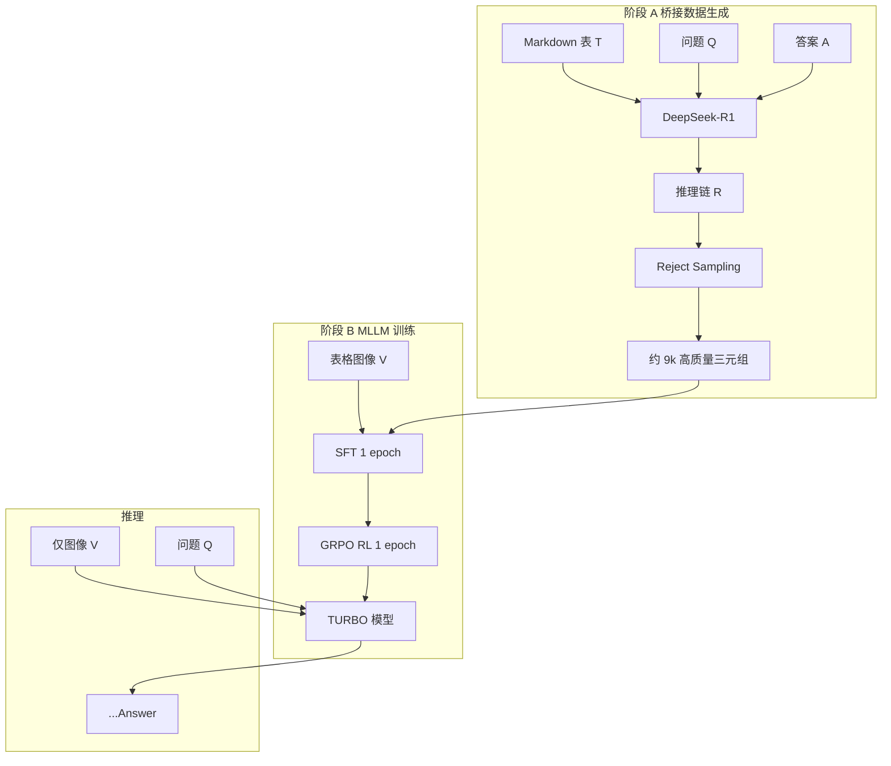

## 0.论文思路



## 1. 复现流程

复现覆盖两个数据集：

| 数据集 | 说明 |
|--------|------|
| **TabMWP** | 小学数学表格题，自带表格 PNG |
| **WikiTableQuestions (WTQ)** | 开放域表格问答，CSV 渲染为 PNG |

### 代码及其完成状态

| 阶段 | 脚本 | 主要产出 |
|------|------|----------|
| 1. 训练集抽样 500 | `scripts/prepare_sample.py` | `train_500.jsonl` |
| 2. 推理链 + Reject Sampling | `scripts/generate_traces.py` | `train_500_bridged.jsonl`（472/500） |
| 3. 仅图 vs 图+ST 对比 | `scripts/compare_st_vs_image.py` | `reports/compare_st_vs_image.png` |
| 4. WTQ 抽样 500 | `scripts/prepare_wtq_sample.py` | `wtq_train_500.jsonl` |
| 5. WTQ 推理链 | `scripts/generate_traces.py` | `wtq_train_500_bridged.jsonl`（459/500） |
| 6. WTQ 仅图 vs ST | `scripts/compare_st_vs_image.py` | `reports/compare_wtq_train_500.png` |
| 7. 测试集 250×2 | `scripts/prepare_eval_sets.py` | `tabmwp_eval_250.jsonl`, `wtq_eval_250.jsonl` |
| 8. QLoRA SFT | `scripts/train_sft.py` | `models/sft_lora/` |
| 9. SFT 评测 | `scripts/eval_sft.py` | `reports/sft_eval_combined.png` |

注：原论文中实行了GRPO强化学习，由于显存限制，最低程度的运行都无法实现，故省略了

---

## 2. 技术框架

### 2.1 语言与运行环境

- **语言**：Python 3.12
- **虚拟环境**：使用venv虚拟环境
- **平台**：Windows + NVIDIA CUDA（本机：RTX 4060 Laptop GPU 8GB）
- **模型下载镜像**：`HF_ENDPOINT=https://hf-mirror.com`

### 2.2 各模块对应依赖

| 层级 | 文件 | 主要包 |
|------|------|--------|
| 基础 | `requirements.txt` | `openai`, `openxlab` |
| 视觉语言推理 | `requirements-vl.txt` | `torch`, `transformers<5`, `accelerate`, `bitsandbytes`, `pillow`, `matplotlib` |
| SFT 微调 | `requirements-sft.txt` | `peft`, `datasets` |

### 2.3 核心模型与 API

| 用途 | 模型 / 服务 | 说明 |
|------|-------------|------|
| Teacher 推理链 | **DeepSeek API**（`deepseek-v4-pro`） | 生成结构化推理轨迹，配置于 `data.env` |
| 本地 MLLM 推理 | **Qwen3-VL-4B-Instruct**（4-bit） | 仅图 vs ST 对比实验 |
| SFT Base + 评测 | **Qwen3-VL-2B-Instruct**（4-bit） | 评测 Base vs SFT |
| 微调方式 | **QLoRA**（量化 SFT） | 训练循环SFT |

### 2.4 代码结构

```
work/reproduction/
├── scripts/          
├── src/             
│   ├── config.py             # HF 镜像、data.env 加载
│   ├── deepseek_client.py    # Teacher API 调用
│   ├── reject_sampling.py    # Reject 规则（TURBO §4.1）
│   ├── trace_utils.py        # 推理链格式、答案匹配
│   ├── inference_prompts.py  # System / User Prompt 模板
│   ├── sft_utils.py          # SFT 数据集、Collate、像素预算
│   ├── vl_inference.py       # Qwen3-VL 4-bit 推理封装
│   ├── wtq_utils.py          # WTQ CSV → Markdown / PNG
│   ├── answer_parse.py       # 从模型输出解析 <answer>
│   └── plot_compare.py       # 对比柱状图
├── data/
│   ├── TabMWP/       # 原始 TabMWP 数据
│   ├── WTQ/          # WikiTableQuestions 原始 TSV
│   └── processed/    # jsonl、stats、checkpoint
├── models/           # LoRA 适配器
└── reports/          # PNG 图表
```

---

## 3. 数据

### 3.1 训练集

| 文件 | 条数 | 来源 | 说明 |
|------|------|------|------|
| `train_500.jsonl` | 500 | TabMWP train，seed=42 | 含 `table_md`、表格 PNG 路径 |
| `train_500_bridged.jsonl` | **472** | DeepSeek + reject | 接受率 94.4% |
| `wtq_train_500.jsonl` | 500 | WTQ training，seed=42 | CSV→MD，matplotlib 渲染 PNG |
| `wtq_train_500_bridged.jsonl` | **459** | DeepSeek + reject | 接受率 91.8% |
| **SFT 合并去重** | **931** | 上述两份 bridged | `merge_bridged()` 按 `dataset:id` 去重 |

每条 bridged 记录包含 `sft_target`，格式为：

```
推理过程<answer>标准答案</answer>
```

SFT 训练时输入为 图像 + 结构化 Markdown 表 + 问题，监督目标为 `sft_target`；评测时使用仅图像输入。

### 3.2 测试集

| 文件 | 条数 | 说明 |
|------|------|------|
| `tabmwp_eval_250.jsonl` | 250 | 与 train_500 无重叠 |
| `wtq_eval_250.jsonl` | 250 | 与 wtq_train_500 无重叠 |

### 3.3 Reject Sampling 规则

实现于 `src/reject_sampling.py`，主要拒绝原因：

- 推理过短 / 过长（40–4000 字符）
- 格式错误或答案与 gold 不匹配
- 推理末尾与标准答案矛盾（`reasoning_contradicts_gold`）

TabMWP 主要因「推理与 gold 矛盾」被拒（27/28）；WTQ 主要因「过长」（38/41）。

---

## 4. 实验方法与参数

### 4.1 推理链生成

| 参数 | 值 |
|------|-----|
| Teacher model | DeepSeek API，`deepseek-v4-pro` |

重要代码：


### 4.2 仅图 vs 图+结构化表（Compare）

| 参数 | 值 |
|------|-----|
| 模型 | Qwen3-VL-**4B**-Instruct |
| 量化 | 4-bit NF4 |
| 条件 | `image_only` / `with_st` |
| 判题 | 字符串匹配 |
| 视觉 token 上限 | 512–640 |

Prompt 设计（`inference_prompts.py`）：

- **image_only**：只看表格图 + 问题
- **with_st**：表格图 + Markdown 结构化表 + 问题
  

### 4.3 QLoRA SFT

| 参数 | 实际使用值 | 说明 |
|------|------------|------|
| Base 模型 | `Qwen/Qwen3-VL-2B-Instruct      |                                         |
| 量化 | 4-bit NF4，double quant |  |
| LoRA rank `r` | 16 | |
| LoRA alpha | 32 | |
| LoRA dropout | 0.05 | |
| Target modules | q/k/v/o_proj, gate/up/down_proj | |
| 学习率 | 2e-4 |                                         |
| Epochs | **0.5** | 约 465 样本步（931×0.5） |
| Grad accumulation | **16** | 有效 batch=16 |
| Max visual tokens | **256** |  |
| Gradient checkpointing | 开启 | |
| Save steps | 20 | 周期性 checkpoint + `checkpoint-latest` |
| 训练时长 | ~40 min | 见 `models/sft_lora/train_stats.json` |
| Final loss | 0.363 | |

训练输入：**图像 + ST + 问题 → sft_target**；Prompt 部分 label 置 `-100`，仅对 assistant 段计算 loss。


### 4.4 SFT 评测

| 参数 | 值 |
|------|-----|
| 模型 | Qwen3-VL-2B + LoRA（`models/sft_lora`） |
| 测试条件 | **image_only**（与论文测试设定一致） |
| 样本 | TabMWP 250 + WTQ 250 = 500 |
| 对比 | Base（无 LoRA）vs SFT |
| 判题 | `answers_match` |
| 断点续跑 | `--resume` |


---

## 5. 实验结果

### 5.1 仅图 vs 图+ST（训练集 500 条，Qwen3-VL-4B）

**TabMWP**（`compare_stats.json`）：

| 条件 | 准确率 |
|------|--------|
| image_only | 97.6%（488/500） |
| with_st | 98.6%（493/500） |
| Δ(ST − 仅图) | +1.0% |

**WTQ**（`wtq_train_500_compare_stats.json`）：

| 条件 | 准确率 |
|------|--------|
| image_only | 54.8%（274/500） |
| with_st | 71.4%（352/493） |
| Δ(ST − 仅图) | +16.6% |

WTQ 上结构化表收益显著高于 TabMWP，符合「开放域表格更难、ST 帮助更大」的预期。

### 5.2 SFT 评测（测试集 500 条，Qwen3-VL-2B，image-only）

来源：`combined_sft_eval_stats.json`

| 范围 | Base | SFT | Δ |
|------|------|-----|---|
| **Overall** | 61.6%（308/500） | 65.6%（328/500） | **+4.0%** |
| TabMWP | 85.2%（213/250） | 90.0%（225/250） | +4.8% |
| WTQ | 38.0%（95/250） | 41.2%（103/250） | +3.2% |

图表：`reports/sft_eval_combined.png`

---

## 6. 与论文的差异与局限

| 项目 | 论文 / 理想设定 | 本复现 |
|------|-----------------|--------|
| 学生 MLLM | 70B | **2B**（显存限制）；对比实验用 **4B** |
| SFT 训练量 | 完整 epoch | **0.5 epoch**（931 样本中约 465 步） |
| 判题器 | Qwen2.5-72B 等强 judge | 直接比对 |
| Teacher | DeepSeek V1 | DeepSeek API（`deepseek-v4-pro`） |
| 训练框架 |  | 手写部分循环 + PEFT+**PyTorch** |
| 硬件 |                        | RTX 4060 8GB |


---

## 7. 小结

复现实现了 TURBO 论文 **数据推理链条连接 → Reject Sampling → QLoRA SFT → 仅图评测** ，在 TabMWP 与 WTQ 两个数据集上验证了以下论文结果：

1. 结构化表（ST） 在 WTQ 上显著优于仅图像输入；
2. **SFT** 在 测试集上相对 Base 提升约 **4%**（Overall 61.6% → 65.6%）；
3. 全流程可在上完成，并通过 checkpoint / 显存参数调优保证可运行，所以对部分步骤和运行条件做了更改。

后续可改进方向：_full epoch SFT、更大 student 模型、更强 LLM judge、与论文数值对齐的超参搜索。
